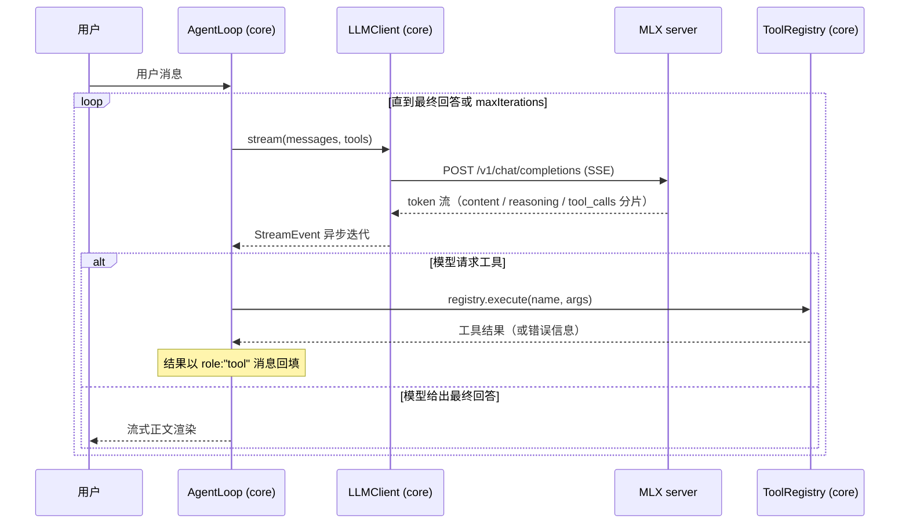

# 架构设计

> 版本：v1.0（Step 1）｜ 日期：2026-08-30
> 上游文档：[REQUIREMENTS.md](REQUIREMENTS.md) ｜ 详细设计：[DESIGN.md](DESIGN.md)

## 1. 系统上下文

```
┌──────────┐  键盘输入/终端输出   ┌─────────────────────────────┐
│  用户     │ ◄───────────────► │  apps/cli（终端壳）           │
└──────────┘                    │  readline、渲染、斜杠命令      │
                                └──────────────┬──────────────┘
                                               │ 进程内调用（import core）
                                ┌──────────────▼──────────────┐
                                │  packages/core（agent 大脑）  │
                                │  Loop ─ Tools ─ Client       │
                                └──────────────┬──────────────┘
                                               │ HTTP（OpenAI 兼容 + SSE）
                                ┌──────────────▼──────────────┐
                                │  LLM 推理引擎                 │
                                │  现在：MLX server (Mac, :8081) │
                                │  将来：llama.cpp (Win/Linux)  │
                                └─────────────────────────────┘
```

边界规则：

- **CLI 是壳，core 是脑**：CLI 只负责输入/渲染，不含任何 agent 逻辑；core 不知道 CLI 的存在
- **core 只说 OpenAI 协议**：对引擎的唯一假设是"实现 OpenAI 兼容接口"，MLX / llama.cpp 可互换
- **工具在 core 进程内执行**：Step 1 的工具是本地函数（mock 天气、数学求值），无外部依赖

## 2. 模块划分

```
packages/core/src/
├── types.ts      # 全部共享类型（消息、工具、事件、guards、SteeringChannel）——单一事实来源
├── client.ts     # LLMClient：OpenAI 兼容 HTTP + SSE 流式解析（timings→usage 回退、AbortSignal）
├── tools.ts      # ToolRegistry：zod→JSON Schema；参数校验；执行策略（超时/重试）+ 互斥键 FIFO
├── loop.ts       # runAgent：主循环编排（守卫/steering/压缩触发/并行工具/取消，学习核心）
├── memory.ts     # token 估算、单元级裁剪（user 绝不丢）、摘要压缩阶梯
├── react.ts      # runReAct：文本/JSON 双协议 ReAct 引擎（与 runAgent 同事件契约）
├── store.ts      # MemoryStore：长期记忆 JSONL + bigram 召回评分
├── predicate.ts  # 完成谓词：任务完成由事件流事实机器裁决（Step 15）
└── index.ts      # 导出公共 API

apps/cli/src/
├── main.ts       # 入口：装配 client + registry + loop + steering 队列 + 取消，REPL
├── ui.ts         # 流式渲染（正文/思考/守卫/取消分色）、颜色
├── wire.ts       # fetch 层原始字节 tee（会话存证 = 引擎原始报文）
├── trace.ts      # traceSse：token 级溯源（seq→frame→line→byte 三方印证，单一实现）
├── faults.ts     # 工具层故障注入（实验道具）
├── llm-faults.ts # LLM 层故障注入（守卫验收道具，Step 9）
└── builtin-tools/  # weather / calculate / memory / delegate（应用层工具）
```

依赖方向（编译期强制，core 不 import apps，apps 单向依赖 core）：

```
apps/cli ──import──► packages/core ──fetch──► LLM 引擎
```

## 3. 核心数据流：Agent 主循环



关键不变量（架构级约束，详见 DESIGN.md §5）：

1. **`messages` 数组是唯一事实来源**——循环不维护任何消息之外的隐藏状态，任何一轮中断都能从 messages 完整重建现场
2. **工具结果必须回填**——无论成功（JSON 结果）还是失败（错误信息），都以 `role:"tool"` 消息进入上下文，让模型自己消化。**这是 agent 区别于 chatbot 的本质**：不是 try/catch 吞掉错误，而是把错误变成模型可推理的信息
3. **循环出口只有两个**——模型给出无 tool_calls 的回答，或 `maxIterations` 触顶（防失控）

## 4. 接口契约（模块间）

core 内部三模块通过以下接口协作（完整签名见 DESIGN.md）：

| 模块 | 对外接口 | 依赖 |
|---|---|---|
| client.ts | `class OpenAIClient implements LLMClient`：`stream(req): AsyncIterable<StreamEvent>` | 仅 fetch |
| tools.ts | `class ToolRegistry`：`register(tool)` / `schemas()` / `execute(name, json)` | zod |
| loop.ts | `runAgent(deps): AsyncIterable<AgentEvent>` | client + registry（依赖注入） |

设计原则：**loop 不 new 任何东西**。client 与 registry 由调用方注入（`deps` 参数），因此测试时注入 mock client 即可复现任意 tool call 序列（NFR-5）。

## 5. 渲染与事件流

`runAgent` 对外暴露的不是"最终答案"，而是**事件流**（`AsyncIterable<AgentEvent>`）：

```
AgentEvent =
  | { type: "round-start", round }                          // 新循环轮次
  | { type: "llm-request", messages }                       // 即将调用 LLM（transcript/谓词消费）
  | { type: "reasoning-delta", delta }                      // 思考 token（CLI 灰色渲染）
  | { type: "text-delta", delta }                           // 正文 token（流式渲染）
  | { type: "tool-call", name, args }                       // 模型发起工具调用（并行时按源序先发全部）
  | { type: "tool-result", name, result, retriesUsed? }     // 工具执行完毕（含守卫回填的未执行说明）
  | { type: "context-trimmed", removedMessages, from/to }   // 裁剪即遗忘（明示）
  | { type: "context-compacted", 去重/降级/摘要轮数 }        // 压缩 ≠ 丢弃（Step 11，两事件严格区分）
  | { type: "guard", guard, detail }                        // 守卫动作（空响应/复读/截断，Step 9）
  | { type: "steering", message }                           // 用户中途指令注入（Step 10）
  | { type: "interrupted", partialText, partialToolCalls }  // 取消：半截量进事件不进 messages（Step 14）
  | { type: "final", message, rounds, usage }               // 最终回答 + 统计（usage 含 timings 回退）
  | { type: "error", message, recoverable }                 // 不可恢复错误（含 user 钉住溢出拒续）
```

事件流是三件事的共同物理基础：CLI 渲染、transcript 存证（NFR-4）、完成谓词机器裁决
（Step 15，verify-acceptance.mjs 重放事件流断言任务完成）。

CLI 消费事件流做渲染，transcript 记录器也消费同一事件流——**一份事件流，多个观察者**，这是 NFR-4（可观测性）的实现基础。

## 6. 面向 Step 2-8 的扩展点

| 未来需求 | 扩展点（现在预留，不实现） |
|---|---|
| Step 2 错误处理与重试 | `AgentEvent.error(recoverable)` 事件已区分可恢复性；工具错误回填机制本身就是 Step 2 的地基 |
| Step 3 上下文裁剪 | messages 传入 loop 前经过 `contextStrategy` 函数（默认恒等）；届时替换实现即可 |
| Step 4 思考模式实验 | `/nothink` 已实现消息级开关；后续扩展为 config 级 |
| Step 6 记忆 | 会话状态 = messages 数组，天然可序列化；记忆模块将作为 messages 的前缀注入器 |
| Step 7 子 agent | 子 agent = 一个工具（`execute` 内部再起一个 runAgent），架构上无需任何改动 |

显式不做的预留：不引入插件系统、不引入中间件链、不做依赖注入容器——**在需要之前保持最简**（YAGNI，也是学习原则：扩展点必须是真实需求逼出来的，而不是想象出来的）。

## 7. 技术选型落地

- 运行时 Node.js 22+，TypeScript 5 strict，pnpm workspace
- core 依赖：zod 4（schema 与校验）；HTTP 用全局 fetch（Node 18+ 内置）
- CLI 渲染：ANSI 转义码手写（不引入 chalk 等装饰库，渲染逻辑本身也是学习材料）
- 测试：node:test 内置测试器；无真实引擎的 mock 回放测试 + 可选的真实引擎 e2e（`TAGENT_E2E=1` 时启用）

决策记录见 [TECH_STACK.md](../TECH_STACK.md) §三、§七。
